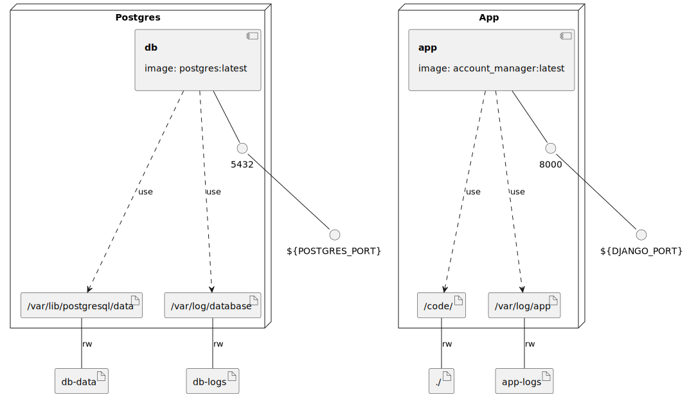

### 1. Clone the repository:

   ```shell
   git clone https://github.com/vladysllav/crypto-projects.git
   ```

### 2. Create a `.env` file based on the `.env.example` file:

   ```shell
   cd crypto-projects/account_manager
   ```

   ```shell
   cp .env.example .env
   ```

### 3. To run, execute:

   ```shell
   docker build -t account_manager:latest .
   ```

   ```shell
   docker compose up -d
   ```

---

# FAQ:

### 1. How to create Django superuser in Docker?

```shell
docker exec -it app python account_manager/manage.py createsuperuser
```

## Migrations:

### 1. How to make migrations in Django?

```shell
python manage.py makemigrations {APPLIACTION_NAME} --name {MIGRATION_NAME}
# example: python manage.py makemigrations project --name add_project_models
```

### 2. How to upgrade Django migration in Docker?

```shell
docker exec -it app python account_manager/manage.py migrate
```

### 3. How to downgrade Django migration in Docker?

```shell
docker exec -it app python account_manager/manage.py migrate {APPLIACTION_NAME} {MIGRATION_ID}
# example: docker exec -it app python account_manager/manage.py migrate project 0001

# if need to downgrade to 0000 migration use "zero"
# example: docker exec -it app python account_manager/manage.py migrate project zero
```

## Pre Commit:

### 1. How to set pre-commit hooks?

```shell
pre-commit install --install-hooks
```

### 2. How to run manually pre-commit code checking?

```shell
pre-commit run --all-files
```
### Infrastructure model

- [app component model](.infragenie/app_component_model.svg)

---
